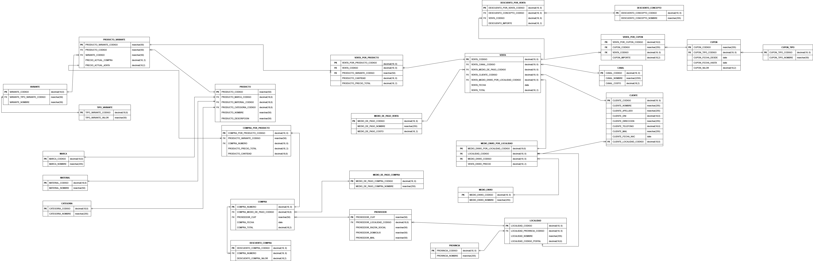
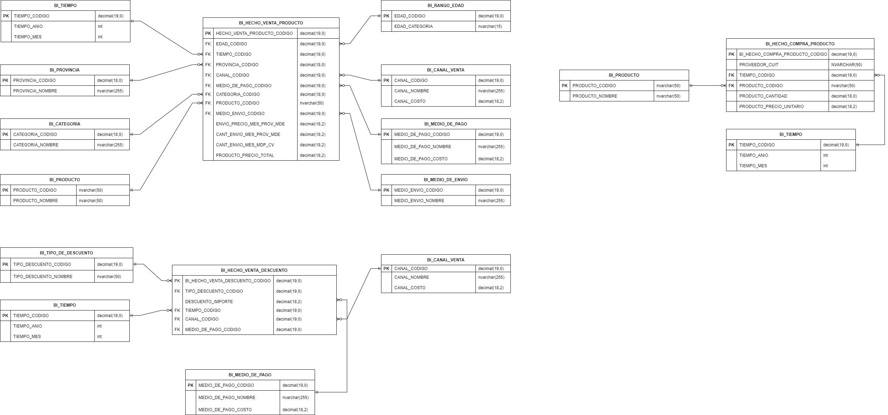

# Gestión Bazaar

Trabajo Práctico de **Gestión de Datos – UTN FRBA**

Proyecto de diseño y migración de una base de datos para un negocio de bazar y regalería. Se parte de una tabla maestra completamente desnormalizada y se construye un modelo relacional normalizado, seguido de un modelo dimensional para Business Intelligence.

## 🗄️ Modelo Relacional

A partir de una tabla `Maestra`, se identificaron las entidades y relaciones necesarias para diseñar un modelo relacional compuesto por 26 tablas.

Se implementaron:

* Claves primarias y foráneas.
* Relaciones entre las entidades.
* Migración de la totalidad de los datos mediante stored procedures (scripts en T-SQL para la creación y carga del modelo).

### DER



## 📊 Modelo de Business Intelligence

Sobre el modelo transaccional se construyó un modelo dimensional en estrella, orientado al análisis de ventas, compras y descuentos.

### Tablas de hechos

* `BI_HECHO_VENTA_PRODUCTO`
* `BI_HECHO_COMPRA_PRODUCTO`
* `BI_HECHO_VENTA_DESCUENTO`

### Dimensiones

* Tiempo
* Provincia
* Rango etario
* Canal de venta
* Medio de pago
* Medio de envío
* Categoría
* Producto
* Tipo de descuento

Se desarrollaron views para obtener los indicadores solicitados, entre ellos:

* Ganancias mensuales por canal de venta.
* Productos con mayor rentabilidad anual.
* Categorías más vendidas por rango etario y mes.
* Ingresos mensuales por medio de pago.
* Descuentos aplicados por tipo, canal y mes.
* Distribución porcentual de envíos por provincia.
* Valor promedio de envío por provincia y medio de envío.
* Variación anual de precios por proveedor.
* Productos con mayor cantidad de reposiciones mensuales.

### DER



## 🛠️ Tecnologías y conceptos

* SQL Server
* T-SQL
* Stored procedures
* Views
* Modelado relacional
* Modelado dimensional / Business Intelligence

## 📁 Estructura del proyecto

```text
├── database/
│   ├── EjecutarScriptTablaMaestra.bat
│   ├── gd_esquema.Maestra.sql
│   └── gd_esquema.Maestra.Table.zip
│
├── ders/
│   ├── DER_relacional.png
│   └── DER_BI.jpg
│
├── documentos/
│   ├── Enunciado.pdf
│   └── Estrategia.pdf
│
├── scripts/
│   ├── script_borrado_de_modelos.sql
│   ├── script_creacion_inicial.sql
│   └── script_creacion_BI.sql
│
└── README.md
```

## ▶️ Ejecución

Para la ejecución del trabajo deben seguirse los siguientes pasos:

1. Descomprimir el archivo [`gd_esquema.Maestra.Table.rar`](database/gd_esquema.Maestra.Table.rar).
2. Ejecutar el script [`EjecutarScriptTablaMaestra.bat`](database/EjecutarScriptTablaMaestra.bat). Este script crea la tabla maestra con los datos desnormalizados.
3. Ejecutar el script [`script_creacion_inicial.sql`](scripts/script_creacion_inicial.sql) para crear y cargar el modelo relacional.
4. Ejecutar [`script_creacion_BI.sql`](scripts/script_creacion_BI.sql), para crear y cargar el modelo dimensional y sus vistas.
<br/>
Los scripts de los pasos 3 y 4 pueden ejecutarse nuevamente las veces que sea necesario.

Para eliminar completamente los modelos creados, se puede ejecutar: [`script_borrado_de_modelos.sql`](scripts/script_borrado_de_modelos.sql).

## 📚 Documentación

La carpeta Documentos contiene el [enunciado original](documentos/Enunciado.pdf) y el documento de [estrategia](documentos/Estrategia.pdf), donde se detallan las decisiones de diseño y la implementación realizada.